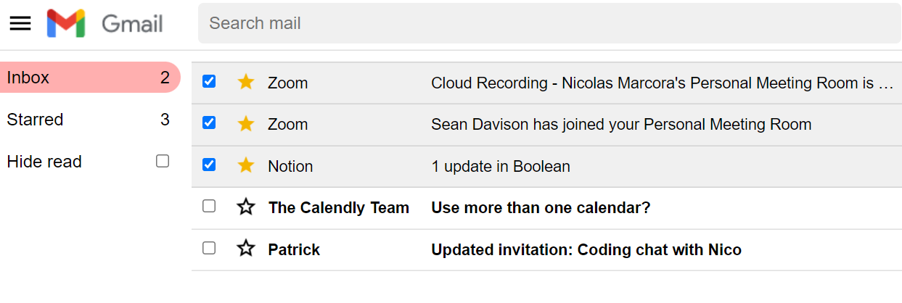

# React State

In this exercise, we are going to practice using state.

You'll use state to render a list of emails like in Gmail. Rendering lists is a very common pattern in React.

You'll use state's `set` function to modify data and render the new changes.

## Setup

1. Fork this repository
2. Clone the forked repository onto your local machines
3. In the root directory, type `npm install`, which installs dependencies for the project
4. Finally, type `npm run start`, which starts a development server that runs your website in the browser. That server will reload your website whenever you make any changes to source files

## Instructions

**DO NOT** break the code down into components; work in `app.js` only.

- Set state using `useState` and `intialEmails`
- Render a list of emails from state so it looks similar to the screenshot above.
  - You can find an HTML template for each email in the templates folder
- Create a `toggleRead` function that updates the target email's **read** property in state, when a user clicks on the checkbox
- Create a `toggleStar` function that updates the target email's **starred** property in state, when a user clicks on the star
- Make sure these changes take effect in the UI

## Tips

- You can ignore the `Header` component for now
- You can use the CSS in `app.css` to help style your list of emails or create your own styles
- `Array.map` is a useful method for rendering lists and modifying state
- Remember to use the `key` attribute when rendering lists in react

## Extension 1

- Get the **Hide Read** checkbox to work in the `left-menu` section. You'll need to use state to keep track of the changes and you'll need a function to filter the emails before they are rendered ie. `getReadEmails(emails)`

## Extension 2

- Get the `left-menu` **inbox** and **starred** menu items to work when clicked. You'll need to use state to keep track of the changes ie. `currentTab` and you'll need a function to filter the emails before they are rendered ie. `getStarredEmails(emails)`
- Replace the hard-coded question marks in the `left-menu`
